# Juno7 Elections - Electoral ERD

Date: 2026-07-16

## 1. Vue d'ensemble

Le diagramme ci-dessous represente le modele cible. Il separe:

- elections et tours;
- territoires administratifs et circonscriptions electorales;
- personnes et candidatures;
- PV attendus, PV recus, documents, resultats, validations et corrections;
- publications publiques versionnees;
- utilisateurs, roles et audit.

## 2. Diagramme Mermaid ER

```mermaid
erDiagram
    TERRITORIES ||--o{ TERRITORIES : "parent"
    TERRITORIES ||--o{ ELECTIONS : "country"
    ELECTIONS ||--o{ ELECTION_ROUNDS : "has"
    ELECTORAL_OFFICES ||--o{ ELECTORAL_DISTRICTS : "defines"
    ELECTIONS ||--o{ ELECTORAL_DISTRICTS : "scopes"
    TERRITORIES ||--o{ ELECTORAL_DISTRICTS : "primary territory"
    ELECTORAL_DISTRICTS ||--o{ ELECTORAL_DISTRICT_TERRITORIES : "contains"
    TERRITORIES ||--o{ ELECTORAL_DISTRICT_TERRITORIES : "member"
    TERRITORIES ||--o{ POLLING_CENTERS : "hosts"
    POLLING_CENTERS ||--o{ POLLING_STATIONS : "contains"

    POLITICAL_PARTIES ||--o{ COALITION_MEMBERS : "member"
    COALITIONS ||--o{ COALITION_MEMBERS : "groups"
    PERSONS ||--o{ CANDIDACIES : "stands as"
    ELECTIONS ||--o{ CANDIDACIES : "has"
    ELECTION_ROUNDS ||--o{ CANDIDACIES : "optional round"
    ELECTORAL_OFFICES ||--o{ CANDIDACIES : "for office"
    ELECTORAL_DISTRICTS ||--o{ CANDIDACIES : "in district"
    POLITICAL_PARTIES ||--o{ CANDIDACIES : "endorses"
    COALITIONS ||--o{ CANDIDACIES : "endorses"

    ELECTIONS ||--o{ EXPECTED_PVS : "expects"
    ELECTION_ROUNDS ||--o{ EXPECTED_PVS : "expects"
    ELECTORAL_OFFICES ||--o{ EXPECTED_PVS : "for office"
    ELECTORAL_DISTRICTS ||--o{ EXPECTED_PVS : "for district"
    POLLING_STATIONS ||--o{ EXPECTED_PVS : "produces"
    ELECTIONS ||--o{ PV_SUBMISSIONS : "receives"
    ELECTION_ROUNDS ||--o{ PV_SUBMISSIONS : "round evidence"
    EXPECTED_PVS ||--o{ PV_SUBMISSIONS : "received as"
    PV_SUBMISSIONS ||--o{ PV_SUBMISSIONS : "potential duplicate"
    PV_SUBMISSIONS ||--o{ PV_DOCUMENTS : "has source"
    PV_SUBMISSIONS ||--o{ PV_RESULTS : "has result layers"
    PV_RESULTS ||--o{ PV_CANDIDATE_RESULTS : "details"
    CANDIDACIES ||--o{ PV_CANDIDATE_RESULTS : "receives votes"
    PV_SUBMISSIONS ||--o{ PV_VALIDATION_CHECKS : "checked"
    PV_RESULTS ||--o{ PV_VALIDATION_CHECKS : "checked"
    PV_SUBMISSIONS ||--o{ PV_ANOMALIES : "has anomaly"
    PV_RESULTS ||--o{ PV_ANOMALIES : "has anomaly"
    PV_DOCUMENTS ||--o{ PV_ANOMALIES : "has anomaly"
    PV_SUBMISSIONS ||--o{ PV_VALIDATIONS : "reviewed by"
    PV_RESULTS ||--o{ PV_VALIDATIONS : "reviewed by"
    PV_SUBMISSIONS ||--o{ PV_DECISIONS : "decided"
    PV_RESULTS ||--o{ PV_DECISIONS : "decided"
    PV_DECISIONS ||--o{ PV_DECISIONS : "supersedes"
    PV_RESULTS ||--o{ RESULT_CORRECTIONS : "source result"
    PV_RESULTS ||--o{ RESULT_CORRECTIONS : "target result"
    PV_ANOMALIES ||--o{ RESULT_CORRECTIONS : "drives"
    RESULT_CORRECTIONS ||--o{ RESULT_CORRECTION_ITEMS : "details"

    ELECTIONS ||--o{ PUBLICATION_BATCHES : "publishes"
    ELECTION_ROUNDS ||--o{ PUBLICATION_BATCHES : "round publication"
    PUBLICATION_BATCHES ||--o{ PUBLICATION_BATCH_ITEMS : "contains"
    EXPECTED_PVS ||--o{ PUBLICATION_BATCH_ITEMS : "batch expected"
    PV_SUBMISSIONS ||--o{ PUBLICATION_BATCH_ITEMS : "batch submission"
    PV_RESULTS ||--o{ PUBLICATION_BATCH_ITEMS : "published result"
    PV_DECISIONS ||--o{ PUBLICATION_BATCH_ITEMS : "batch decision"
    PUBLICATION_BATCHES ||--o{ PUBLISHED_RESULT_SNAPSHOTS : "publishes snapshot"
    TERRITORIES ||--o{ PUBLISHED_RESULT_SNAPSHOTS : "aggregation territory"
    ELECTORAL_DISTRICTS ||--o{ PUBLISHED_RESULT_SNAPSHOTS : "aggregation district"
    ELECTORAL_OFFICES ||--o{ PUBLISHED_RESULT_SNAPSHOTS : "aggregation office"
    CANDIDACIES ||--o{ PUBLISHED_RESULT_SNAPSHOTS : "candidate snapshot"

    USERS ||--o{ USER_ROLES : "assigned"
    ROLES ||--o{ USER_ROLES : "grants"
    TERRITORIES ||--o{ USER_ROLES : "scope"
    ELECTIONS ||--o{ USER_ROLES : "scope"
    USERS ||--o{ PV_SUBMISSIONS : "field or source"
    USERS ||--o{ PV_DOCUMENTS : "created"
    USERS ||--o{ PV_RESULTS : "entered"
    USERS ||--o{ PV_VALIDATION_CHECKS : "executed"
    USERS ||--o{ PV_ANOMALIES : "assigned"
    USERS ||--o{ PV_VALIDATIONS : "validated"
    USERS ||--o{ PV_DECISIONS : "decided"
    USERS ||--o{ RESULT_CORRECTIONS : "requested or approved"
    USERS ||--o{ PUBLICATION_BATCHES : "prepared or approved"
    USERS ||--o{ AUDIT_LOGS : "actor"

    TERRITORIES {
        bigint id PK
        bigint parent_id FK
        text level
        text code
        text name
        text normalized_name
        text iso_code
        boolean is_active
        date valid_from
        date valid_to
    }

    ELECTIONS {
        bigint id PK
        text code UK
        text name
        text description
        bigint country_territory_id FK
        text status
        date starts_on
        date ends_on
        timestamptz created_at
        timestamptz archived_at
    }

    ELECTION_ROUNDS {
        bigint id PK
        bigint election_id FK
        integer round_number
        text label
        text status
        date polling_date
        timestamptz opens_at
        timestamptz closes_at
        timestamptz created_at
        timestamptz archived_at
    }

    ELECTORAL_OFFICES {
        bigint id PK
        text code UK
        text name
        text default_scope_level
        text description
        boolean is_active
    }

    ELECTORAL_DISTRICTS {
        bigint id PK
        bigint election_id FK
        bigint office_id FK
        text code
        text name
        text scope_level
        bigint primary_territory_id FK
        boolean is_active
    }

    ELECTORAL_DISTRICT_TERRITORIES {
        bigint id PK
        bigint district_id FK
        bigint territory_id FK
    }

    POLLING_CENTERS {
        bigint id PK
        bigint territory_id FK
        text code
        text name
        text address
        numeric latitude
        numeric longitude
        boolean is_active
    }

    POLLING_STATIONS {
        bigint id PK
        bigint polling_center_id FK
        text code
        text label
        integer registered_voters
        boolean is_active
    }

    POLITICAL_PARTIES {
        bigint id PK
        text name UK
        text acronym UK
        text color
        text logo_url
        text address
        text phone
        text email
        text status
        timestamptz created_at
        timestamptz archived_at
    }

    COALITIONS {
        bigint id PK
        text name UK
        text acronym
        text color
        text logo_url
        text status
        timestamptz created_at
        timestamptz archived_at
    }

    COALITION_MEMBERS {
        bigint id PK
        bigint coalition_id FK
        bigint party_id FK
        date valid_from
        date valid_to
    }

    PERSONS {
        bigint id PK
        text first_name
        text last_name
        text display_name
        date birth_date
        text photo_url
        text external_ref UK
        timestamptz created_at
        timestamptz archived_at
    }

    CANDIDACIES {
        bigint id PK
        bigint election_id FK
        bigint round_id FK
        bigint person_id FK
        bigint office_id FK
        bigint district_id FK
        bigint party_id FK
        bigint coalition_id FK
        text candidate_code
        text ballot_name
        text ballot_number
        integer display_order
        text campaign_color
        text status
        timestamptz created_at
        timestamptz archived_at
    }

    EXPECTED_PVS {
        bigint id PK
        text public_id UK
        bigint election_id FK
        bigint round_id FK
        bigint office_id FK
        bigint district_id FK
        bigint polling_station_id FK
        text expected_pv_code
        text status
        jsonb metadata
        boolean is_active
        timestamptz created_at
        timestamptz updated_at
        timestamptz archived_at
    }

    PV_SUBMISSIONS {
        bigint id PK
        text public_id UK
        bigint expected_pv_id FK
        bigint election_id FK
        bigint round_id FK
        text received_pv_code
        text transmission_channel
        timestamptz received_at
        bigint field_agent_user_id FK
        bigint source_user_id FK
        text processing_status
        text document_quality
        text content_hash
        bigint potential_duplicate_of_id FK
        text notes
        jsonb technical_metadata
        boolean is_active
        timestamptz created_at
        timestamptz updated_at
        timestamptz archived_at
    }

    PV_DOCUMENTS {
        bigint id PK
        text public_id UK
        bigint pv_submission_id FK
        text storage_uri
        text mime_type
        bigint file_size_bytes
        text checksum
        integer page_number
        integer document_order
        text status
        jsonb metadata
        bigint created_by_user_id FK
        timestamptz created_at
        timestamptz updated_at
        timestamptz archived_at
    }

    PV_RESULTS {
        bigint id PK
        text public_id UK
        bigint pv_submission_id FK
        text result_layer
        integer version_number
        text result_status
        integer registered_voters
        integer voters
        integer valid_ballots
        integer blank_votes
        integer null_votes
        integer expressed_votes
        integer envelopes_count
        integer ballots_count
        text data_source
        text source_notes
        bigint created_by_user_id FK
        bigint updated_by_user_id FK
        jsonb metadata
        boolean is_active
        timestamptz created_at
        timestamptz updated_at
        timestamptz archived_at
    }

    PV_CANDIDATE_RESULTS {
        bigint id PK
        text public_id UK
        bigint pv_result_id FK
        bigint candidacy_id FK
        integer votes
        integer entry_order
        text observations
        jsonb metadata
        timestamptz created_at
        timestamptz updated_at
    }

    PV_VALIDATION_CHECKS {
        bigint id PK
        text public_id UK
        bigint pv_submission_id FK
        bigint pv_result_id FK
        text check_type
        text check_status
        jsonb expected_value
        jsonb observed_value
        jsonb details
        boolean executed_by_system
        bigint executed_by_user_id FK
        timestamptz executed_at
    }

    PV_ANOMALIES {
        bigint id PK
        text public_id UK
        bigint pv_submission_id FK
        bigint pv_result_id FK
        bigint pv_document_id FK
        text anomaly_type
        text severity
        text description
        text anomaly_status
        bigint assigned_to_user_id FK
        text resolution_notes
        timestamptz opened_at
        timestamptz closed_at
        jsonb metadata
    }

    PV_VALIDATIONS {
        bigint id PK
        text public_id UK
        bigint pv_submission_id FK
        bigint pv_result_id FK
        bigint validator_user_id FK
        text validation_type
        text validation_decision
        text comment
        integer validated_version
        jsonb metadata
        timestamptz validated_at
    }

    PV_DECISIONS {
        bigint id PK
        text public_id UK
        bigint pv_submission_id FK
        bigint pv_result_id FK
        text decision_type
        text decision_status
        bigint decided_by_user_id FK
        text role_code
        text reason
        timestamptz decided_at
        integer target_version
        text approval_level
        bigint previous_decision_id FK
        jsonb metadata
        boolean is_active
    }

    RESULT_CORRECTIONS {
        bigint id PK
        text public_id UK
        text correction_target_type
        bigint correction_target_id
        bigint source_pv_result_id FK
        bigint target_pv_result_id FK
        bigint requested_by_user_id FK
        bigint approved_by_user_id FK
        bigint anomaly_id FK
        text reason
        text correction_status
        timestamptz requested_at
        timestamptz approved_at
        timestamptz applied_at
        text sensitivity_level
        jsonb metadata
    }

    RESULT_CORRECTION_ITEMS {
        bigint id PK
        bigint correction_id FK
        text field_name
        jsonb old_value
        jsonb new_value
        text justification
        integer item_order
        text validation_status
        timestamptz created_at
    }

    PUBLICATION_BATCHES {
        bigint id PK
        text public_id UK
        bigint election_id FK
        bigint round_id FK
        text publication_type
        integer version_number
        text publication_status
        bigint prepared_by_user_id FK
        bigint approved_by_user_id FK
        timestamptz prepared_at
        timestamptz approved_at
        timestamptz published_at
        timestamptz withdrawn_at
        text public_note
        text batch_checksum
        jsonb metadata
        timestamptz created_at
        timestamptz updated_at
    }

    PUBLICATION_BATCH_ITEMS {
        bigint id PK
        bigint publication_batch_id FK
        text item_type
        bigint expected_pv_id FK
        bigint pv_submission_id FK
        bigint pv_result_id FK
        bigint pv_decision_id FK
        integer item_order
        jsonb metadata
        timestamptz created_at
    }

    PUBLISHED_RESULT_SNAPSHOTS {
        bigint id PK
        text public_id UK
        bigint publication_batch_id FK
        text aggregation_level
        bigint territory_id FK
        bigint district_id FK
        bigint office_id FK
        bigint candidacy_id FK
        integer votes
        integer registered_voters
        integer voters
        integer valid_ballots
        integer blank_votes
        integer null_votes
        integer expressed_votes
        numeric percentage
        integer ranking
        timestamptz calculated_at
        jsonb metadata
    }

    USERS {
        bigint id PK
        text email UK
        text display_name
        text status
        timestamptz created_at
        timestamptz archived_at
    }

    ROLES {
        bigint id PK
        text code UK
        text name
        text description
    }

    USER_ROLES {
        bigint id PK
        bigint user_id FK
        bigint role_id FK
        bigint territory_id FK
        bigint election_id FK
        timestamptz valid_from
        timestamptz valid_to
    }

    AUDIT_LOGS {
        bigint id PK
        timestamptz occurred_at
        bigint user_id FK
        text role_code
        text action
        text entity_type
        text entity_id
        jsonb old_value
        jsonb new_value
        text reason
        text source
        inet ip_address
        text session_id
        text request_id
    }
```

## 3. Verification des relations essentielles

- Chaque election cible un pays dans `territories`.
- Chaque tour appartient a une election.
- Chaque circonscription appartient a une election et a un poste.
- Chaque centre appartient a un territoire administratif.
- Chaque bureau appartient a un centre.
- Chaque candidature appartient a une personne, une election, un poste et une circonscription.
- Chaque PV attendu appartient a un tour, un poste, une circonscription et un bureau.
- Chaque PV recu peut etre rapproche d'un PV attendu.
- Chaque resultat de PV appartient a une submission.
- Chaque resultat par candidat appartient a une candidature.
- Chaque controle, anomalie, validation et decision cible une submission, un resultat ou un document source.
- Chaque correction conserve un en-tete et des items champ par champ.
- Chaque publication appartient a une election et peut cibler un tour.
- Chaque publication publique expose des `published_result_snapshots` separes des tables de saisie.
- Chaque action sensible peut etre rattachee a un utilisateur et a l'audit.

## 4. Notes de conception

- `published_result_snapshots` permet de publier des aggregations sans exposer directement les tables de saisie.
- Les couches de `pv_results` remplacent la confusion actuelle entre donnees saisies, verifiees et publiees.
- `expected_pvs` permet de calculer la progression sans deduire les PV attendus des seuls resultats recus.
- `candidacies` separe le contexte electoral de l'identite generale dans `persons`.
- `electoral_district_territories` evite de forcer toute circonscription a correspondre a un seul territoire administratif.
